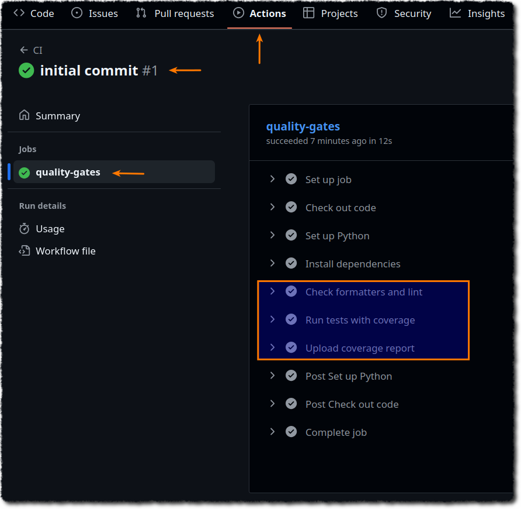

> **AI Note:** I had AI assist me with preparing this lab but i have double-checked & lab tested everything so there shouldn't be any bugs. ✌️

# CI/CD Lab – Python + GitHub Actions (Tested Setup)

This lab provides a minimal, lab-tested CI pipeline for a Python project using:

- **Black** (formatting)
- **isort** (imports)
- **Flake8** (linting)
- **Pytest + Coverage** (tests + coverage threshold)
- **GitHub Actions** (CI on push / pull request to `main`)

Follow this guide to **replicate the exact setup** locally and in GitHub.

---

## 1) Prerequisites

- **Git** installed.
- **Python 3.10+** installed.
- A **GitHub account** and a empty repo.
- (Optional) A code editor with Python support (VS Code, PyCharm, etc.).
- This lab setup assumes you are running some Linux flavor (I built this on Ubuntu).
- This lab assumes you have gone through the notes in [N007 - CICD and Quality Gate](N007%20-%20CICD%20and%20Quality%20Gate.md).

> Confirm versions:

```bash
git --version
python3 --version
```

---

## 2) Project Structure

```
├── .github/
│   └── workflows/
│       └── ci.yml             # GitHub Actions CI/CD workflow
├── hooks/
│   └── pre-commit             # Pre-commit hook script
├── pyproject.toml             # Configuration for Black, isort, and pytest
├── README.md                  # Project README
├── requirements.txt           # Project dependencies
├── scripts/
│   ├── tools.sh               # Script to manually run formatting tools
│   └── install_hook.sh        # Script to install the pre-commit hook
├── src/
│   └── apps/
│       └── calculator_private.py  # Application source code
└── tests/
    └── test_calculate.py      # Unit tests for the application. Used by pytest.
```

**Key choices**:

- **Src layout**: code lives under `src/`, package root is configured via `pyproject.toml`.
- **Coverage gate**: enforced via pytest `addopts` in `pyproject.toml` (80% by default).
- **CI**: workflow in `.github/workflows/ci.yml` runs on push/PR to `main`.

> [!important]
> `pyproject.toml` file is explained in detail in *`pyproject.toml`* under *Configuration Reference* section at the end. Refer to it before continuing if unfamiliar.
---

## 3) Local Setup (Step-by-Step)

1) **Download & Unzip** the lab files:

```bash
# step1: download
# git clone OR you can simply grab it from this github using your browser.
git clone https://github.com/wondering-packet/ci-cd-lab-files.git
# step2: cd & unzip
cd ci-cd-lab-files/
unzip ci-cd-lab.zip
# step3: cd into the lab foler
cd ci-cd-lab/
```

2) **Create & activate** a virtual environment:

```bash
# using virtual environment for this lab project so we don't mess with 
# the system's python!

python3 -m venv .venv
source .venv/bin/activate
```

3) **Install dependencies**:

```bash
# requirements file lets us define dependent packages &
# the exact versions required for a python project.
cat requirements.txt  
# you should see these:
# flake8==7.1.0  
# pytest==8.2.0  
# black==23.9.1  
# isort==5.12.0  
# pytest-cov==5.0.0

# installs the packages
pip install -r requirements.txt
```


4) **Install the package in editable mode** (required for `src/` layout imports in tests):

```bash
pip install -e .
```

> This will use our `pyproject.toml` config file & create a "app.egg-info" directory inside src/ directory.

5) Prepare Git:

```bash
# step1: initialize git in this folder
git init
# step2: set main as the default branch
git branch -m main
# step3: configure your username & email; replace them with yours. 
git config user.name wondering-packet # "Your Name"
git config user.email "packetwondering@gmail.com" # "your.email@example.com"
git config user.name # validate
# output: your name
git config user.email # validate
# output: your email
# step4: connect to remote repo
git remote add origin <repo_url>
git remote -v # validate
origin  <repo_url> (fetch)  
origin  <repo_url> (push)
```

> [!warning]
>
> Do not stage & push yet!
> 
> Reason is: we still have the `hooks/pre-commit` file which we need to install & then remove.  If you stage this file (tracked) then it will cause future commits to fail because the file contains a keyword which we are using to block commits.

6) **Install local pre-commit hook**:

```bash
# this script copies our hooks/pre-commit file to .git/hooks/pre-commit location.
bash scripts/install_hook.sh

# IMPORTANT:
# remove the pre-commit file from hooks/ folder.
# note that the install script has already copied this file to .git/hooks.

# if you don't remove this file then your commits later will fail since 
# this file contains the keyword "TODO" - this keyword is used in the lab 
# to stop commits.
rm hooks/pre-commit
```

6) **(Optional) Manually run formatters for quick validation**:

```bash
isort --check-only .  # "." means all files (recursive)
black --check .
```

> If these fail, then you can auto-fix with:

```bash
isort .
black .
```

7) **Run linter**:

```bash
flake8 --exclude .venv/
```

8) **Run tests with coverage** (threshold enforced via `pyproject.toml`):

```bash
pytest -q  # -q suppresses noise from the output
```

This will fail the run if coverage is below the configured threshold (default **80%**). It also produces a `coverage.xml` report. The 80% config is in our tooling config file:

```plaintext
[tool.pytest.ini_options]  
addopts = "--cov=src --cov-report=term-missing --cov-report=xml --cov-fail-under=80"
```

---

## 4) Pre-commit hook

> [!important]
> Pre-commit hook is explained in detail in *`.git/hooks/pre-commit`* under *Configuration Reference* section at the end. Refer to it before continuing if unfamiliar.

Stage & Commit:

```bash
git add .
git commit -m "initial commit"
```

Expected output:

```
 Running pre-commit checks...  
 isort (auto-fix imports on staged .py files)...  
 black (auto-fix formatting on staged .py files)...  
狀 Re-staging formatted files...  
 Running flake8 on staged files...  
✅ Pre-commit checks passed.  
[main (root-commit) 8d50873] initial commit  
10 files changed, 496 insertions(+)  
create mode 100644 .github/workflows/ci.yml  
create mode 100644 .github/workflows/release.yml  
create mode 100644 .gitignore  
create mode 100644 README.md  
create mode 100644 pyproject.toml  
create mode 100644 requirements.txt  
create mode 100644 scripts/install_hook.sh  
create mode 100644 scripts/tools.sh  
create mode 100644 src/apps/calculator_private.py  
create mode 100644 tests/test_calculate.py
```


> [!NOTE]
> 
> **Don't Push Yet**. We will push in next section.

## 5) GitHub Actions (CI)

Github Actions looks for workflow files under `.github/workflows` directory so we will be adding our CI workflow `ci.yml` file under this directory. 

> [!important]
> `ci.yml` is explained in detail in *`.github/workflows/ci.yml` * under *Configuration Reference* section at the end. Refer to it before continuing if unfamiliar.

### How to enable CI in your repo

1) Make sure `.github/workflows/ci.yml` file is present.
2) Push to remote:

```bash
git push -u origin main
```

2) In GitHub:
	1) go to **Actions** tab. The workflow should appear automatically and run on the next push/PR to `main`.
	2) Open the workflow that was executed for your commit. If you followed exact steps it should be "initial commit".
	3) You can see our tasks/tests performed by the workflow in this image (highlighted square section): 

3) To **download coverage** from a run: open the workflow run → **Artifacts** → download `coverage-xml`.

---

## 6) Troubleshooting

**Q: `ModuleNotFoundError: No module named 'apps'`**  
A: Make sure you ran `pip install -e .` so the `src/` package is discoverable.

**Q: CI fails on formatting**  
A: Run locally (this auto fixes any formatting issues):

```bash
isort .
black .
```

Commit, push again.

**Q: CI fails on coverage (below 80%)**  
A: Add or improve tests under `tests/`, or (not recommended) lower the threshold in `pyproject.toml`.

**Q: I don’t see the workflow in GitHub**  
A: Ensure the file path is exactly `.github/workflows/ci.yml` on the default branch (`main`). Check Actions are enabled in repo settings.

---

## 7) Extending the Lab (Example)

### 1. Add another test:

1) **Add a new function** in `src/apps/calculator_private.py`:

	```python
	def power(a, b):
	    return a ** b
	```

2) **Test it** in `tests/test_calculate.py`:

	```python
	# power added now
	from apps.calculator_private import add, divide, multiply, subtract, power  
	  
	  
	def test_add():  
	assert add(3, 7) == 10  
	assert add(-1, 1) == 0  
	assert add(0, 0) == 0  
	assert divide(10, 5) == 2  
	assert multiply(3, 6) == 18  
	assert subtract(10, 5) == 5  
	assert power(2, 3) == 8  # calling power() function
	```

3) **Run coverage test**:
	
	```bash
	pytest -q
	.                                                                     [100%]
	---------- coverage: platform linux, python 3.12.3-final-0 -----------  
	Name                             Stmts   Miss  Cover   Missing  
	--------------------------------------------------------------  
	src/apps/calculator_private.py      14      0   100%  
	--------------------------------------------------------------  
	TOTAL                               14      0   100%  
	Coverage XML written to file coverage.xml  
	  
	Required test coverage of 80% reached. Total coverage: 100.00%  
	1 passed in 0.18s
	```

### 2. Cause coverage failure:

1) **Remove a few functions from the `tests/test_calculate.py`:**

```python
# i have removed a few functions, now the test file looks like this:
from apps.calculator_private import add, divide  
  
  
def test_add():  
assert add(3, 7) == 10  
assert add(-1, 1) == 0  
assert add(0, 0) == 0  
assert divide(10, 5) == 2
```

2) **Run the coverage test:**

```bash
pytest -q  
.                                                                         [100%]
  
---------- coverage: platform linux, python 3.12.3-final-0 -----------  
Name                             Stmts   Miss  Cover   Missing  
--------------------------------------------------------------  
src/apps/calculator_private.py      12      4    67%   7-8, 12-13  
--------------------------------------------------------------  
TOTAL                               12      4    67%  
Coverage XML written to file coverage.xml  
  
FAIL Required test coverage of 80% not reached. Total coverage: 66.67%  
1 passed in 0.18s
```

CI will pick up these new changes on push/PR.

### 3) Cause style failure:

1) Modify app `src/apps/calculator_private.py`:

```python
def power(a, b):  
return a ** b  
def add(a, b):   # i removed the 2 whitelines before the function definition 
result = a + b   # this fails pep8 compliance.
return result  
  
  
def subtract(a, b):  
result = a - b  
return result  
  
  
def multiply(a, b):  
result = a * b  
return result  
  
  
def divide(a, b):  
result = a / b  
return result
```

2) Run flake8 manually:

```bash
flake8 --exclude .venv/  
# output clearly states the failed file, line number & reason.
./src/apps/calculator_private.py:3:1: E302 expected 2 blank lines, found 0
```

---

## 8) Configuration Reference

### a) `pyproject.toml` (important parts)

```toml
# --------------------------------------------------------------------
# pyproject.toml
#
# Purpose:
# Centralized configuration for Python packaging, tools, and testing.
# - Defines how the project is built and packaged
# - Holds formatting/linting configs for Black & isort
# - Holds pytest & coverage settings
# --------------------------------------------------------------------

[build-system]
# Build requirements for the package
requires = ["setuptools>=68"]             # Use setuptools 68+ for packaging
build-backend = "setuptools.build_meta"   # Default backend for setuptools builds

[project]
# Package metadata
name = "apps"                             # Package name (installable via pip)
version = "0.1.0"                         # Package version
requires-python = ">=3.10"                # Minimum Python version
description = "CI/CD lab with tests and flake8"   # Short project description
readme = "README.md"                       # README file for package description

[tool.setuptools]
# Specify source directory for packages
package-dir = {"" = "src"}                 # All Python packages are inside src/

[tool.setuptools.packages.find]
# Auto-discover packages from the src directory
where = ["src"]

[tool.black]
# Black formatter configuration
line-length = 88                           # Max line length
target-version = ['py310']                 # Target Python version 3.10
skip-string-normalization = true           # Preserve original string quotes

[tool.isort]
# isort import sorter configuration
profile = "black"                          # Match Black’s import style
line_length = 88                           # Same line length as Black

[tool.pytest.ini_options]
# pytest configuration
addopts = """
--cov=src                              # Measure coverage for 'src' directory
--cov-report=term-missing              # Show missing lines in terminal
--cov-report=xml                       # Generate XML report (for CI uploads)
--cov-fail-under=80                     # Fail if coverage < 80%
"""

```

### b) `.github/workflows/ci.yml` 

```yaml
# ============================
# GitHub Actions Workflow: CI
# ============================
# Purpose:
# This workflow runs automatically on pushes or pull requests to "main".
# It checks code formatting (Black, isort), lints (flake8), runs tests (pytest),
# and uploads the coverage report.
# ============================

name: CI

# ----------------------------
# When should this workflow run?
# ----------------------------
on:
  push:
    branches: [ "main" ]        # Trigger when pushing directly to main
  pull_request:
    branches: [ "main" ]        # Trigger when a PR targets main

jobs:
  quality-gates:
    runs-on: ubuntu-latest      # GitHub-hosted runner (Ubuntu Linux)

    steps:
      # ----------------------------
      # Step 1: Check out the code
      # ----------------------------
      - name: Check out code
        uses: actions/checkout@v4  # Pulls the repo content into the runner

      # ----------------------------
      # Step 2: Set up Python
      # ----------------------------
      - name: Set up Python
        uses: actions/setup-python@v5
        with:
          python-version: '3.10'  # The Python version for this job

      # ----------------------------
      # Step 3: Install dependencies
      # ----------------------------
      - name: Install dependencies
        run: |
          python -m pip install --upgrade pip  # Upgrade pip itself
          pip install -r requirements.txt      # Install tool/test dependencies
          pip install -e .                # Install the project in editable mode

      # ----------------------------
      # Step 4: Check formatting & lint
      # ----------------------------
      - name: Check formatters and lint
        run: |
          # Black & isort configs are in pyproject.toml
          black --check .           # Verify code style with Black
          isort --check-only .      # Verify import order matches Black profile
          flake8 .                  # Run linting (style & error checks)

      # ----------------------------
      # Step 5: Run tests with coverage
      # ----------------------------
      - name: Run tests with coverage
        run: |
          # pytest & coverage configs are in pyproject.toml
          pytest                    # Run the test suite

      # ----------------------------
      # Step 6: Upload coverage report
      # ----------------------------
      - name: Upload coverage report
        uses: actions/upload-artifact@v4
        with:
          name: coverage-xml        # Artifact name in GitHub
          path: coverage.xml        # Path to the coverage report file

```

### c) `.git/hooks/pre-commit`

```bash
#!/usr/bin/env bash  
# Pre-commit hook:  
# - Blocks "TODO" in staged changes  
# - Auto-fixes imports (isort) & formatting (black) for STAGED .py files only  
# - Re-stages formatted files  
# - Lints only STAGED .py files with flake8  
set -euo pipefail  
IFS=$'\n\t'  
  
echo " Running pre-commit checks..."  
  
# 1) Prefer running inside your local virtualenv if present  
if [[ -f ".venv/bin/activate" ]]; then  
# shellcheck source=/dev/null  
source ".venv/bin/activate"  
fi  
  
# 2) Block TODOs in staged diff  
if git diff --cached | grep -qi "TODO"; then  
echo "❌ Commit blocked: staged changes contain 'TODO'"  
exit 1  
fi  
  
# 3) Collect staged Python files (Added, Copied, Modified), null-delimited for safety  
mapfile -d '' -t STAGED_PY_FILES < <(  
git diff --cached --name-only -z --diff-filter=ACM | grep -z -E '\.py$' || true  
)  
  
if (( ${#STAGED_PY_FILES[@]} > 0 )); then  
echo " isort (auto-fix imports on staged .py files)..."  
printf '%s\0' "${STAGED_PY_FILES[@]}" | xargs -0 -r isort --quiet --  
  
echo " black (auto-fix formatting on staged .py files)..."  
printf '%s\0' "${STAGED_PY_FILES[@]}" | xargs -0 -r black --quiet --  
  
echo "狀 Re-staging formatted files..."  
git add -- "${STAGED_PY_FILES[@]}"  
  
# 4) Lint ONLY the staged files  
if command -v flake8 >/dev/null 2>&1; then  
echo " Running flake8 on staged files..."  
# Extra belt-and-suspenders: exclude .venv even if someone passes a dir later  
printf '%s\0' "${STAGED_PY_FILES[@]}" | xargs -0 -r flake8 --exclude=.venv --  
else  
echo "ℹ flake8 not found; skipping Python lint step."  
fi  
else  
echo "⏭  No staged Python files — skipping isort/black/flake8."  
fi  
  
echo "✅ Pre-commit checks passed."  
exit 0
```

---

Happy shipping! If you clone this lab and follow the steps, you’ll get the **exact same, reproducible** CI behavior locally and in GitHub.
